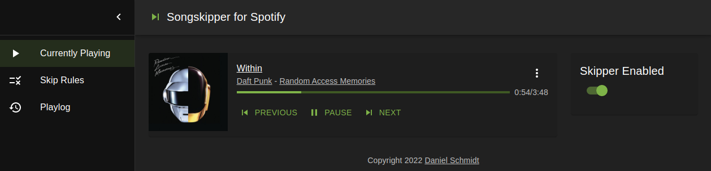
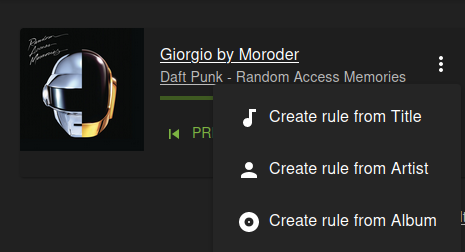
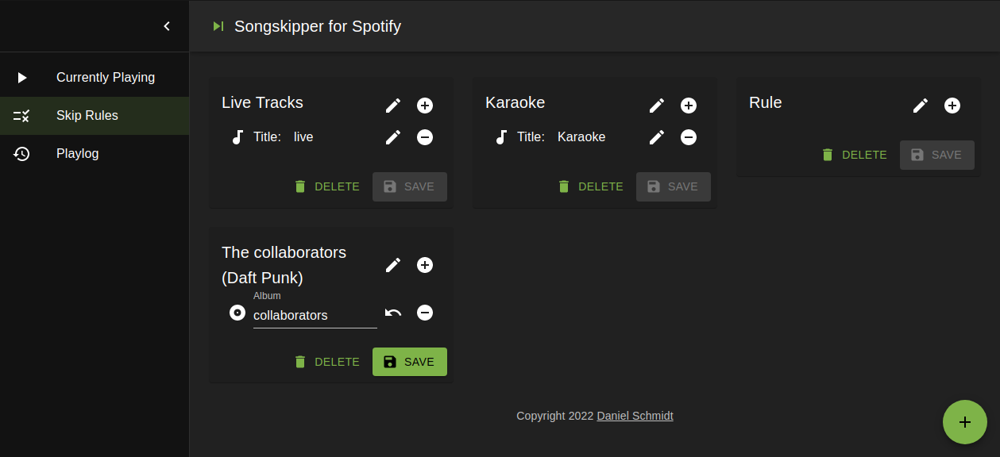
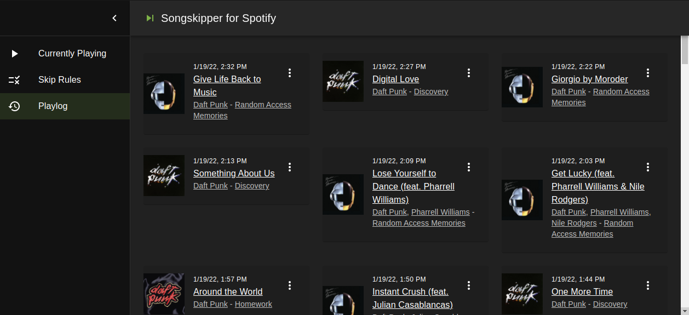

# Songskipper
Skip songs on Spotify

## Use Case
When playing random songs from artists, albums, playlists, etc. once in a while an unexpected live version or specific song interrupts the flow.

This application polls the currently playing song and skips it, if it matches a rule. Rules can be based on album, artist and/or song titles.

## Demo
I am working on it. If you want to test the demo please send me a mail with the email address you use for Spotify, so I can add you as a test user.

It only works with premium accounts.

## Screenshots
- Currently Playing screen\

- Create new rule from track\

- Rules screen\

- Playlog screen\

## Why does it exist
- To skip songs I don't wan't to hear
- To learn about technologies that I wanted to try ;-)

## Development
### Repo structure
- The backend in `songskipper-backend` is a Spring Boot application (mainly written in Kotlin)
- The frontend in `songskipper-frontend` is a React App using [MaterialUI](https://mui.com/) and [Redux Toolkit](https://redux-toolkit.js.org/) with RTK query.
- The communication between backend and frontend use REST endpoints under /api and websockets with STOMP
- In the combined gradle build, the frontend is compiled with node as a standard react app and the generated files are added to the generated jar file of the backend as static resources.

### Build
1. Register the application at https://developer.spotify.com/ to get a client id and secret
2. Copy the file [`songskipper-backend/src/main/resources/application-secrets.yml.template`](songskipper-backend/src/main/resources/application-secrets.yml.template), remove the `.template` extension and enter your client id and secret
3. Build it: `./gradlew build`
4. Run it: `java -jar songskipper-backend/build/libs/songskipper-backend-0.0.1-SNAPSHOT.jar`
5. Open it in the browser: `http://localhost:8080/`

### Development server for frontend
1. Launch the backend (with `java -jar ...` or with `./gradlew bootRun`).
2. Launch the frontend as dev-server: `/gradlew nodeStart` or `npm start` from `songskipper-frontend`
3. Open it in the browser: `http://localhost:3000/`

This version notices file changes and reloads the frontend when needed.

You might need to sign in by accessing the backend version directly.

## License
Not yet decided. Please send me a message if you want to use it.

This is private project and is not related to Spotify.
